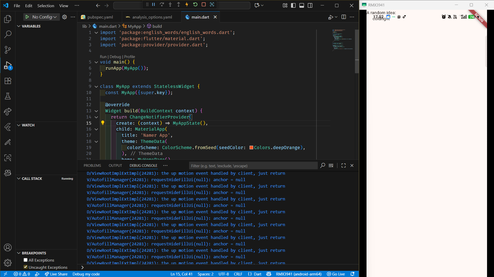
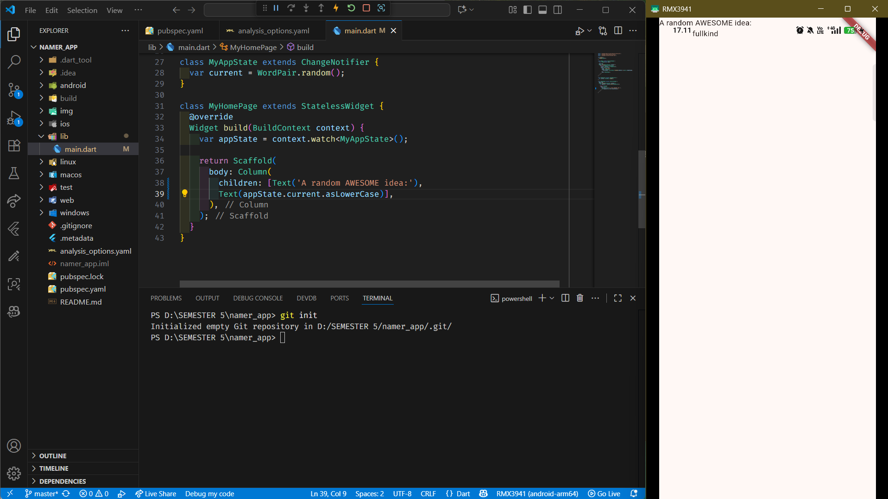
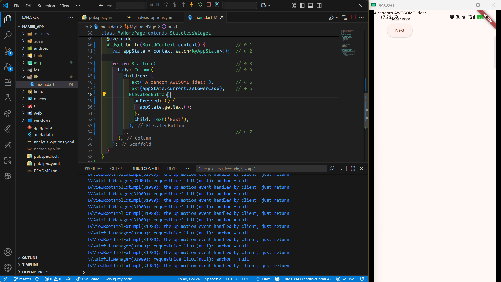
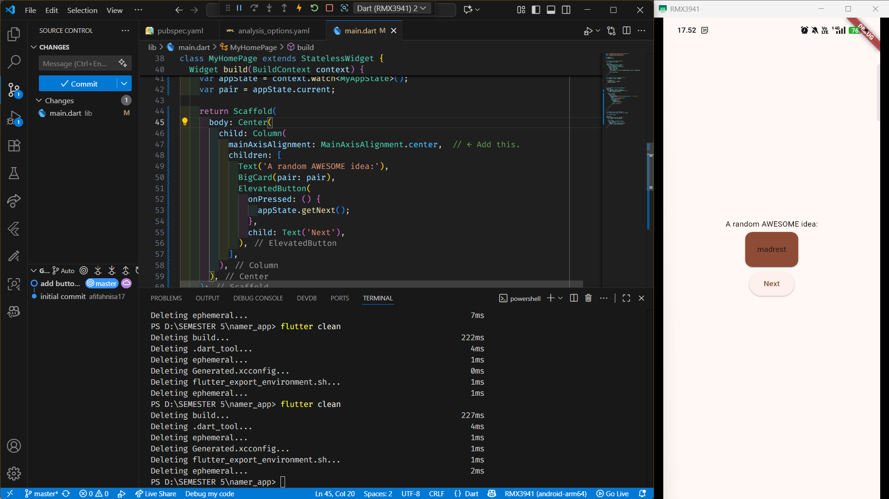
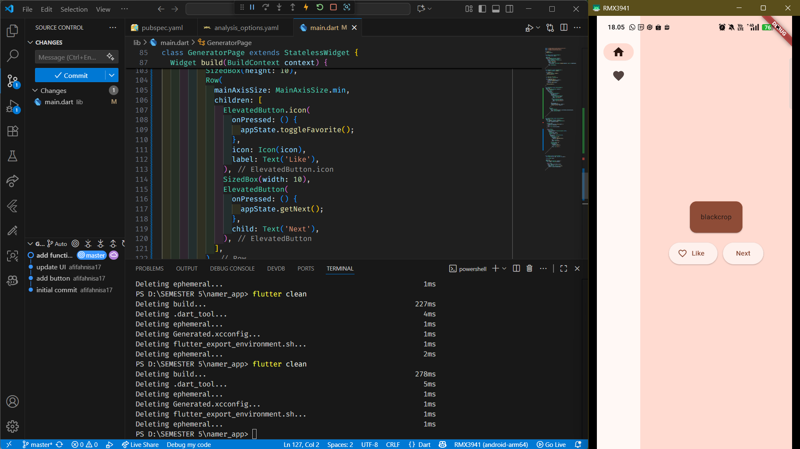
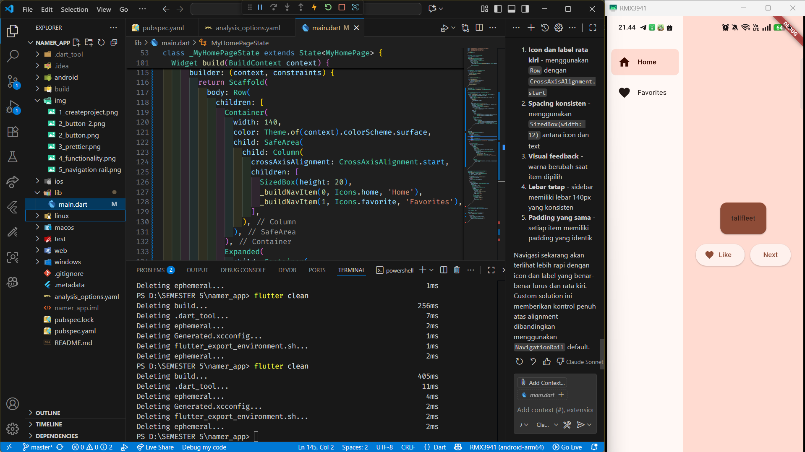
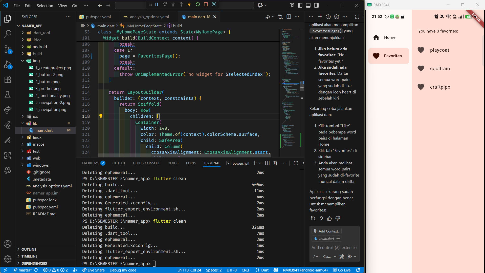

<h1 align="center">NAMER APP 📲</h1>

<table>
  <tr>
    <td><b>Nama</b></td>
    <td>:</td>
    <td>Afifah Khoirunnisa</td>
  </tr>
  <tr>
    <td><b>Kelas</b></td>
    <td>:</td>
    <td>TI-3G</td>
  </tr>
  <tr>
    <td><b>NIM</b></td>
    <td>:</td>
    <td>2341720250</td>
  </tr>
  <tr>
    <td><b>No. Abs</b></td>
    <td>:</td>
    <td>02</td>
  </tr>
</table>  

---

## 1. CREATE PROJECT

Projek ini dimulai dari import kata-kata bahasa inggris, matererial dart, dan provider.

Ada beberapa class yaitu:
- Main, class dimana pertama kali dijalankan yang didalamnya menjalankan MyApp.
- My App, berisi hal yang umum seperti tema, menampilkan nama aplikasi,
- My Home Page, berisi isi dalam aplikasi yaitu A random Idea dan text random.

## 2. ADD A BUTTON

Sekarang, kita bisa klik tombol button, dan kata random akan otomatis muncul

## 3. MAKE THE APP PRETTIER

Untuk membuat tampilan lebih cantin, kita perlu membuat kata berwarna merah dan tombol next yang bisa di klik.

## 4. ADD FUNCTIONALITY

Sekarang kita bisa klik tombol like dan akan berubah menjadi hati merah jika di klik.

## 5. ADD NAVIGATION RAIL

Kita menambah navigasi, label, dan nama iconnya.

## 6. ADD A NEW PAGE

Langkah terakhir, kita bisa menyimpan kata favourite yang kita sukai di page baru.